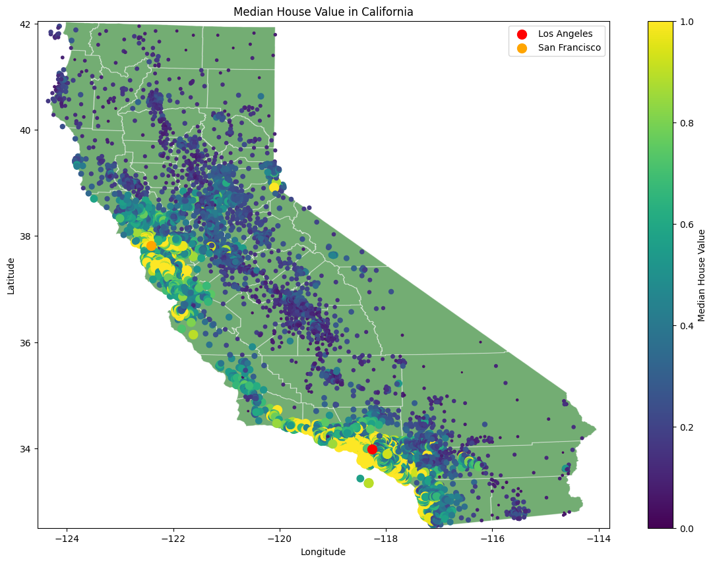

# 🎯 Segmentation et Clustering de Clients avec Python

Ce projet propose une approche complète de la **segmentation de clientèle** à l’aide de techniques d’**apprentissage non supervisé**. L’objectif est d’identifier des groupes de clients distincts à partir de données comportementales et démographiques, afin d’optimiser les stratégies marketing.

🔗 **Lien vers le notebook** : [Notebook Segmentation de Clients](https://github.com/JWulfran/Machine-learning/blob/1d93e44b0a8a976b0d153ded55f44e49b20c8737/Python_Customer_segmentation_%26_clustering.ipynb)

## 📌 Objectifs

- Segmenter la base de clients pour des actions marketing ciblées.
- Appliquer des algorithmes de clustering comme **K-Means** et le **clustering hiérarchique**.
- Extraire des insights exploitables à partir des clusters identifiés.

---

## 🧰 Technologies utilisées

- **Python** (Pandas, NumPy, Scikit-learn, Seaborn, Matplotlib)
- **Jupyter Notebook** pour l’analyse exploratoire et la modélisation
- **K-Means**, **clustering agglomératif**, **dendrogrammes**
- **PCA** (Analyse en Composantes Principales) pour la visualisation

---

## 📈 Étapes du projet

1. **Prétraitement des données**

   - Gestion des valeurs manquantes
   - Encodage des variables catégorielles
   - Normalisation des variables

2. **Analyse exploratoire (EDA)**

   - Statistiques descriptives
   - Visualisations univariées et bivariées

3. **Clustering**

   - Méthode du coude et score de silhouette pour le choix du k optimal
   - Application de K-Means et du clustering hiérarchique

4. **Recommandations métier**
   - Profilage des segments
   - Idées d’actions marketing personnalisées

---

## 📊 Résultats clés

- Identification de groupes de clients aux comportements distincts (ex : gros dépensiers, clients fidèles, sensibles aux promotions).
- Illustration de la valeur stratégique de la segmentation pour le ciblage commercial.

---

## 🧠 Ce que j’ai appris

- Implémenter des algorithmes de clustering dans un contexte réel.
- Préparer des données efficacement pour l’apprentissage non supervisé.
- Traduire des résultats techniques en recommandations business concrètes.

---

📂 _Ce projet fait partie de mon portfolio en science des données et apprentissage automatique. N'hésitez pas à le cloner, à l'explorer ou à proposer des améliorations !_

---

# 🏡 Prédiction de Prix Immobiliers avec Machine Learning (Python)

Ce projet vise à prédire les prix de logements à partir de caractéristiques structurées (surface, nombre de pièces, année de construction, etc.) en utilisant des algorithmes de **machine learning supervisé**.

🔗 **Notebook GitHub** : [Housing_price_prédiction.ipynb](https://github.com/JWulfran/Machine-learning/blob/ae4d989558ffc296eefa2335d8cb53f767d12653/Housing_price_pr%C3%A9diction.ipynb)

---

## 📌 Objectifs du projet

- Explorer un jeu de données sur l’immobilier
- Mettre en œuvre des modèles de régression pour estimer le prix des maisons
- Comparer les performances de différents algorithmes
- Améliorer les prédictions avec de l’optimisation de modèle et de la sélection de variables

---

---

## 🧰 Technologies et outils utilisés

- **Python** (Pandas, NumPy, Scikit-learn, Seaborn, Matplotlib)
- **Jupyter Notebook** pour l’analyse interactive
- Algorithmes :
  - Régression Linéaire
  - Régression Ridge/Lasso
  - Arbres de Décision et Random Forest
- Évaluation via **RMSE**, **MAE**, **R²**

---

## 🔍 Étapes du projet

1. **Chargement et préparation des données**

   - Nettoyage, gestion des valeurs manquantes
   - Encodage des variables catégorielles
   - Standardisation

2. **Analyse exploratoire**

   - Visualisations : corrélations, distributions, outliers
   - Sélection de variables pertinentes

3. **Modélisation**

   - Entraînement de plusieurs modèles
   - Évaluation des performances avec validation croisée

4. **Optimisation**

   - Réglage d’hyperparamètres (GridSearchCV)
   - Réduction du surapprentissage

5. **Résultats finaux**
   - Comparaison des modèles
   - Interprétation des prédictions

---

## 📊 Résultats

- Le modèle **Random Forest Regressor** a fourni les meilleures performances sur les données de test avec un bon équilibre biais/variance.
- Visualisation des écarts entre prédiction et valeur réelle pour mieux interpréter les erreurs.

---

## 🧠 Ce que j’ai appris

- Préparer un dataset réel pour des modèles de régression
- Comparer et évaluer plusieurs approches de modélisation
- Appliquer la validation croisée pour éviter le surapprentissage
- Valoriser un projet de data science orienté business (immobilier)

---

📂 _Ce projet fait partie de mon portfolio en science des données. Il illustre ma capacité à transformer des données en insights prédictifs avec une approche rigoureuse et reproductible._

---

# 🛒 Analyse du Panier d’Achat (Market Basket Analysis) – Python

Ce projet applique une **analyse du panier d’achat** (Market Basket Analysis) à l’aide de **l’algorithme Apriori**, afin d’identifier des **règles d’association** entre les produits achetés ensemble. Il est couramment utilisé dans les secteurs du retail et de l’e-commerce pour optimiser le cross-selling et le merchandising.

🔗 **Notebook GitHub** : [Market_basket_analysis.ipynb](https://github.com/JWulfran/Python_for_Data_Science/blob/0e817a1d26ed4510787a5092997d6b0ebd0407c3/Market_basket_analysis.ipynb)

---

## 🎯 Objectifs du projet

- Identifier les **produits fréquemment achetés ensemble**
- Générer des **règles d’association** (ex: si A → alors B)
- Visualiser les patterns d’achats pour orienter les actions commerciales
- Comprendre le **comportement client** à travers les transactions

---

## 🛠️ Technologies utilisées

- **Python**
  - `pandas`, `mlxtend`, `numpy`
  - `matplotlib`, `seaborn` pour la visualisation
- **Algorithmes** : Apriori, règles d’association (`association_rules`)

---

## 📈 Étapes du projet

1. **Chargement des données transactionnelles**

   - Format type : transactions ou panier par ligne

2. **Préparation des données**

   - Transformation en **tableau binaire** (one-hot encoding)
   - Nettoyage des données produits

3. **Application de l’algorithme Apriori**

   - Définition d’un **support minimum**
   - Extraction des **itemsets fréquents**

4. **Génération de règles d’association**

   - Calcul des métriques : _support_, _confiance_, _lift_
   - Filtrage des règles pertinentes

5. **Visualisation des résultats**
   - Diagrammes de support/lift/confiance
   - Heatmaps des corrélations

---

## 📊 Résultats

- Identification de combinaisons de produits fréquentes
- Règles du type :
  - _"Clients qui achètent du pain achètent souvent aussi du fromage"_
- Recommandations possibles pour :
  - Cross-selling / ventes croisées
  - Promotions ciblées
  - Optimisation du placement en magasin

---

## 🧠 Ce que j’ai appris

- Appliquer des techniques de **data mining** dans un contexte commercial
- Utiliser **Apriori et association_rules** pour des règles interprétables
- Analyser les données transactionnelles pour orienter les décisions stratégiques

---

📂 _Ce projet illustre mon savoir-faire en science des données appliquée au marketing et à l’analyse comportementale. Il est parfaitement transposable à des cas réels de vente au détail ou d’e-commerce._
